<div align="center">


  **Garden irrigation controller for Home Assistant.**
</div>

---

[](https://github.com/Neffez/naiad/actions/workflows/release.yml)

Naiad replaces the irrigation automation logic that typically lives inside Home Assistant (Irrigation Unlimited, automations, pyscript, helpers, dashboard cards) with a single standalone web application. Home Assistant remains the driver for the physical switches and the source of weather and sensor data; everything else, like schedules, factor calculation, manual planning, history and UI happens in Naiad. For the Home Assistant app repo see [app-naiad](https://github.com/Neffez/app-naiad).

<div align="center">
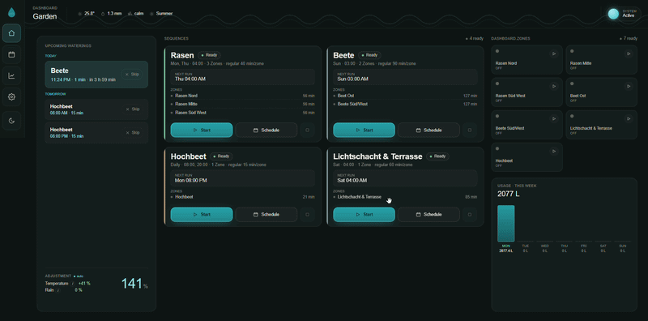
</div>

## Table of Contents

* [Why](#why)
* [Scope](#scope)
* [Tech Stack](#tech-stack)
* [Architecture](#architecture)
* [How to Run](#how-to-run)
    * [Home Assistant App](#home-assistant-app)
    * [Docker Compose](#docker-compose)
    * [Local Development (without Docker)](#local-development-without-docker)
* [Configuration](#configuration)
    * [Environment Variables](#environment-variables)
    * [Configuration Sections](#configuration-sections)
    * [Authentication](#authentication)
* [Scheduling & Safety](#scheduling--safety)
* [Statistics in Home Assistant](#statistics-in-home-assistant)
* [Hardware Compatibility](#hardware-compatibility)
* [Screenshots](#screenshots)
* [Disclaimer](#disclaimer)
* [License](#license)

## Why

A HA-native irrigation stack is spread across too many layers. A small change, like adding a zone, adjusting a schedule or tweaking a watchdog requires coordinated edits across YAML, automations, pyscript, helpers, and dashboard cards. Naiad consolidates that logic into one codebase with a clean web UI and a single configuration file.

## Scope

- **Hardware-agnostic.** A valve is any Home Assistant `switch.*` entity, so whatever HA can switch (KNX, Zigbee, Shelly, Tasmota, …) works — Naiad itself knows nothing about the underlying bus.
- **Requires Home Assistant** as the hardware driver layer: it switches valves and supplies the rain/wind/season sensors and weather forecasts over the HA WebSocket API.

## Tech stack

- Python 3.12 + FastAPI backend, served as a single Docker image
- React + Vite + TypeScript + CSS frontend (statically served by the backend)
- TanStack React Query for data fetching, `react-i18next` for i18n (DE + EN)
- SQLite for persistence (SQLModel ORM)
- APScheduler for cron-style scheduling
- Real-time updates via WebSocket (sequence state, valve changes, factor updates, HA status)
- Docker images published to GHCR for `amd64` + `arm64`

The built frontend is a release artifact, not committed source. `npm run build`
generates `static/` locally; the Docker release build regenerates it from
`src/frontend/` and copies it into the runtime image.

## Architecture

Naiad runs as a single container. The FastAPI backend serves the REST API, the
live WebSocket, and the statically built React frontend. All irrigation logic
lives in the backend; Home Assistant is reduced to a hardware driver and a
sensor/weather source.

The valve and sensor layers sit behind `IValveDriver` / `ISensorSource`
protocols (`src/backend/naiad/drivers/`). v1 ships `HAEntityDriver` /
`HAEntitySensorSource`, which talk to any `switch.*` / `sensor.*` /
`binary_sensor.*` over the HA WebSocket API. 

## How to run

### Home Assistant App

Install via the Home Assistant App Repo: https://github.com/Neffez/app-naiad

### Docker Compose
```bash
git clone https://github.com/Neffez/naiad
cd naiad
cp .env.example .env          # add HA_TOKEN and NAIAD_PASSWORD_HASH
mkdir -p data
cp config.example.yaml data/config.yaml  # first-boot seed; afterwards edit in the UI
docker compose up -d
```

Open `http://<host>:8080` in your browser.

### Local Development (without Docker)

Prerequisites: Python 3.12+, Node 20+.

**One-time setup**

```bash
# From the project root — optional: seed the first boot from a config.yaml.
# Skip this entirely to start empty and configure everything in the UI.
mkdir -p data
cp config.example.yaml data/config.yaml   # adjust zones, sequences, sensors
```

If you do seed from YAML, it applies on first boot only. Afterwards the
database is the source of truth and you edit the config in the UI. To re-seed
from YAML, delete `data/naiad.db` first.

**Terminal 1 — Backend**

Linux/macOS
```bash
cd src/backend
python -m venv .venv && source .venv/bin/activate
pip install -e ".[dev]"
set -a; source ../../.env; set +a
NAIAD_CONFIG=../../data/config.yaml NAIAD_DATA_DIR=../../data \
  uvicorn naiad.main:app --host localhost --port 8080 --reload
```

Windows (PowerShell)
```powershell
cd src/backend
python -m venv .venv; .venv\Scripts\activate
pip install -e ".[dev]"
Get-Content ..\..\\.env | Where-Object { $_ -match '^[^#].+=.' } |
  ForEach-Object { $k,$v = $_ -split '=',2; [System.Environment]::SetEnvironmentVariable($k,$v) }
$env:NAIAD_CONFIG="..\..\data\config.yaml"; $env:NAIAD_DATA_DIR="..\..\data"
uvicorn naiad.main:app --host localhost --port 8080 --reload
```
**Terminal 2 — Frontend**

```bash
cd src/frontend
npm install --legacy-peer-deps  # only on first run
npm run dev
```

Open `http://localhost:5173` in Browser.

The vite-dev-server will proxy `/api/*` to `http://localhost:8080`, WebSocket included — no CORS-Setup required.

**Tests & Linting (Backend)**

```bash
cd src/backend && pytest
ruff check naiad tests
mypy naiad
```

## Configuration

The configuration lives in the SQLite database and is **edited in the UI**
(Settings → System → *System configuration*): HA connection, sensor mapping,
zones, sequences, factors, and auth. Changes are validated on save and applied
live without a restart (a restart is only needed when the HA connection URL/token
itself changes). Use **Export/Import** in the config editor for backup and
git/vault versioning.

`config.yaml` is **optional**. If no database config exists yet, Naiad starts
empty and you configure everything in the UI. As a convenience you can instead
seed the first boot from a `config.yaml` (mounted at `/data/config.yaml` in
Docker, or pointed to by `NAIAD_CONFIG`) — start from
[`config.example.yaml`](config.example.yaml). After seeding, the database is
authoritative and the YAML is no longer read.

### Environment variables

Secrets are never stored in the database or YAML, they come from the
environment only (see [`.env.example`](.env.example)).

| Variable | Required                                                                  | Purpose |
|---|---------------------------------------------------------------------------|---|
| `HA_TOKEN` | yes (unless running as the [HA app](https://github.com/Neffez/app-naiad)) | Home Assistant long-lived access token (HA → profile → Security). |
| `NAIAD_PASSWORD_HASH` | when `auth.mode: password`                                                | App password, bcrypt hash. Generate with `python -c "import bcrypt; print(bcrypt.hashpw(b'pw', bcrypt.gensalt()).decode())"`. |
| `NAIAD_CONFIG` | no                                                                        | Path to an optional first-boot seed `config.yaml` (default `/data/config.yaml`). |
| `NAIAD_DATA_DIR` | no                                                                        | Directory for the SQLite database (default `/data`). |
| `MQTT_PASSWORD` | when `mqtt.enabled` and the broker requires auth                          | Password for the MQTT broker used by the statistics bridge. |
| `TZ` | recommended                                                               | Scheduler timezone, e.g. `Europe/Berlin`. |

### Configuration sections

| Section         | Purpose                                                                                                                                                                                                                                                                                                                                                 |
|-----------------|---------------------------------------------------------------------------------------------------------------------------------------------------------------------------------------------------------------------------------------------------------------------------------------------------------------------------------------------------------|
| `ha`            | HA WebSocket URL.                                                                                                                                                                                                                                                                                                                                       |
| `sensors`       | Entity IDs for rain, wind, season, temperature, the four precipitation forecast sensors, an optional `temperature_max` (forecast daily peak), optional `precipitation_actual` (actual precipitation amount in mm for the water-balance and ET₀ modes), and an optional `et0` daily evapotranspiration sensor (mm/day) for the ET₀ mode.                                                                                                             |
| `zones`         | Per-zone `label`, `switch` entity, and `flow_lph` (used for liter tracking).                                                                                                                                                                                                                                                                            |
| `sequences`     | Ordered `zones`, `basis_min_per_zone`, allowed `range`, `watchdog_min`, `enabled`, `wind_blocks` (skips the run on a wind alarm), and a `schedule` — `days` (ISO 1=Mon…7=Sun, empty = every day) + `times` (`HH:MM`), with an advanced `cron` escape hatch that overrides them when set.                                                                |
| `factors`       | `temp` (linear scaling around `basis_c`, clamped to `min_pct`..`max_pct`) and `rain`. `rain.mode: forecast` keeps the existing forecast-based reduction with `threshold_prob`, `reduce_above_mm`, `zero_above_mm`, `forecast_decay`, `peak_tomorrow`. `rain.mode: water_balance` additionally uses recent actual precipitation from `sensors.precipitation_actual` as a decaying rain credit (`water_balance_days`, `water_balance_decay`) so rain earlier in the week can reduce a later scheduled run. `rain.mode: et0` replaces the heuristic decay with a physical soil water balance: recent rain is drained by the daily reference evapotranspiration (the `sensors.et0` entity when configured, else computed via Hargreaves from the temperature history and the HA latitude) and capped at `et0_reservoir_mm` (the root zone's plant-available water). When `confirm_with_rain_sensor` is enabled, forecast peaks and water-balance precipitation deltas only count while the binary rain sensor actually detected rain. The temperature input prefers the forecast daily max, then falls back to yesterday's recorded max, and only uses the current temperature as a last resort. |
| `mqtt`          | Optional MQTT bridge: statistics sensors plus control entities (master switch, start/stop buttons, manual factor) — see [Statistics in Home Assistant](#statistics-in-home-assistant). `enabled`, broker `host`/`port`/`username`, `discovery_prefix`, `base_topic`.                                                                                     |
| `notifications` | Optional HA push notifications.                                                                                                                                                                                                                                                                                                                         |
| `auth`          | `mode` (`password` \| `forward_header` \| `none`), the shared `password`, optional `auto_login` for trusted embedding contexts, `ingress` trust for the HA App sidebar (additive — coexists with `mode`), and `frame_ancestors` for the CSP header.                                                                                                     |

### Authentication

`auth.mode` selects how the API and WebSocket are protected:

- **`password`** — a single shared password (bcrypt hash in `NAIAD_PASSWORD_HASH`)
  issues bearer tokens stored client-side. Repeated failed logins from one IP are
  throttled with a growing temporary lockout (in-memory, per source IP) to blunt
  online brute force.
- **`forward_header`** — trust an authenticated user asserted by a reverse proxy
  via a header (e.g. Authelia/Authentik). **Set `trusted_proxies` to your proxy
  IP(s)**: with it empty the header is trusted from any client, which is unsafe
  on a directly reachable port (Naiad logs a startup warning in that case).
- **`none`** — no auth; only safe behind HA ingress or a trusted proxy.

HA app **ingress** trust is additive on top of any mode: requests proxied by
the Supervisor are treated as already authenticated, so the sidebar needs no
Naiad login while the direct port still enforces `mode`.

## Scheduling & safety

Each sequence registers 1-5 cron triggers per scheduled time. When a run fires
(cron, manual, or a one-off plan), Naiad:

1. **Gates the run.** It is skipped when the sequence is disabled, paused, the
   global master switch is off, the season sensor is off, or (for
   `wind_blocks` sequences) the wind alarm is on. The global master switch and
   per-sequence pause only block *new* runs — they don't stop one already in
   progress.
2. **Computes the watering factor** from temperature and forecast rain and
   scales `basis_min_per_zone` by it, clamped to the sequence's `range`. A factor
   of 0 % (e.g. forecast rain at/above `zero_above_mm`) skips an automatic run
   entirely rather than watering the range minimum. The factor is *not* applied
   to single-zone plans, which water for exactly the requested duration. A
   *manual* start always runs (it isn't subject to the factor-0 skip).
3. **Runs the zones in order**, one valve at a time within a run. Runs are
   serialized per *zone*, not globally: several runs can proceed in parallel as
   long as their zone sets are disjoint, while a run requesting a zone already
   reserved by another run (or by a pending valve close) is rejected. A run
   history row is written at zone start and finalized (duration, liters, abort
   reason) when the zone ends.

Two independent safety mechanisms bound a run:

- **Watchdog.** Each zone is bounded by `watchdog_min`; if a zone overruns it is
  forced off and the run aborts. The watchdog bounds a *single zone*, not the
  whole run, so size it above the per-zone duration.
- **Live rain abort.** If the rain *sensor* turns on mid-run, the live run is
  stopped immediately (distinct from the forecast-rain *factor*, which only
  reduces the duration).

**Pause / resume.** A paused run persists a resume snapshot (which zone, how much
time was left) and can be resumed later; starting a different sequence discards a
lingering snapshot.

**Crash recovery.** In-flight runs persist an `ActiveRun` record. When Home
Assistant first becomes reachable after a restart, Naiad either resumes the
interrupted zone (if its planned window hasn't elapsed) or closes all valves and
discards the stale run. On every (re)connect while idle it also reconciles
valves — closing any switch left open externally — since Naiad treats itself as
the authoritative valve controller. An HA disconnect does **not** abort a live
run: the run continues, the resilient turn-off retries once HA returns, and the
watchdog still bounds it.

## Statistics in Home Assistant

Naiad keeps its own run history in SQLite (visible on the History screen). It can
*also* mirror the tracked liters and run durations back into Home Assistant as
native sensor entities, so the data flows on into HA's long-term statistics and —
via HA's InfluxDB integration — into InfluxDB and Grafana.

This uses [MQTT discovery](https://www.home-assistant.io/integrations/mqtt/#mqtt-discovery):
when `mqtt.enabled` is set and a broker is reachable, Naiad publishes (retained)
discovery configs and state under one **Naiad** device. The entities:

| Entity | Type | Meaning |
|---|---|---|
| `sensor.naiad_water_total` | `total_increasing`, `water`, `L` | Cumulative liters across all zones |
| `sensor.naiad_water_<zone>` | `total_increasing`, `water`, `L` | Cumulative liters per zone |
| `sensor.naiad_runtime_total` | `total_increasing`, `duration`, `min` | Cumulative run minutes |
| `sensor.naiad_runtime_<zone>` | `total_increasing`, `duration`, `min` | Cumulative run minutes per zone |
| `sensor.naiad_last_run_liters` | `measurement`, `water`, `L` | Liters of the most recent run |
| `sensor.naiad_last_run_duration` | `measurement`, `duration`, `min` | Minutes of the most recent run |
| `sensor.naiad_last_run` | `timestamp` | When the most recent run ended |
| `sensor.naiad_rain_credit` | `measurement`, `precipitation`, `mm` | Rain credit used by the factor (decayed actual rain in water-balance mode, the ET₀ soil balance in et0 mode) |
| `sensor.naiad_rain_factor` | `measurement`, `%` | Current rain multiplier applied to automatic runs |
| `sensor.naiad_adjustment_factor` | `measurement`, `%` | Current combined automatic watering factor |

The water/runtime values are recomputed from the SQLite history on every publish
(after each run, including external/manual valve activity, and on every
(re)connect), so they never drift from what Naiad recorded. The rain/adjustment
values are published from Naiad's current factor calculation after weather
refreshes and reconnects. Messages are retained, so the figures survive both
Naiad and Home Assistant restarts.

For the Grafana path: HA's InfluxDB integration exports **state changes** (not
the statistics tables), so it picks these sensors up automatically. Point Grafana
at InfluxDB and build the dashboard from there (e.g. a per-day water consumption
panel via `difference()` on the cumulative `naiad_water_total`).

### Control entities

The same MQTT device also exposes control entities, so Naiad can be driven from
HA automations and voice assistants ("start lawn watering") without opening the
Naiad UI:

| Entity | Type | Action |
|---|---|---|
| `switch.naiad_master` | switch | Global watering on/off (the same master switch as in the UI) |
| `switch.naiad_manual_mode` | switch | Toggle the manual adjustment-factor mode (bypasses the automatic temp/rain factor) |
| `number.naiad_manual_factor` | number, `%` | The manual adjustment factor; values are clamped to the configured bounds |
| `button.naiad_start_<sequence>` | button | Start a sequence |
| `button.naiad_stop_<sequence>` | button | Stop a sequence (idempotent; also discards a paused run) |

The safety model stays intact: a start command goes through exactly the same
gate path as a scheduled run — master switch, paused override, wind block,
season, zero-factor skip, zone conflicts, and the runner's recovery/cleanup
locks — so MQTT control can never open a valve the scheduler would not have
opened. Runs started this way appear in the history with trigger `mqtt`.

Note that commands are authorized by the **MQTT broker's** authentication, not
by Naiad's API login: anyone who can publish to the broker can use these
controls, so secure the broker accordingly.

The bridge is entirely optional and best-effort: a missing or unreachable broker
is logged and ignored, it never affects irrigation.

## Hardware compatibility

Naiad works with any hardware that Home Assistant exposes as the right entity
types.

| Component | Status | Notes |
|---|---|---|
| Valves — any HA `switch.*` | ✅ works | Whatever HA can switch (KNX, Zigbee, Shelly, Tasmota, …). |
| Sensors — any `binary_sensor.*` / `sensor.*` | ✅ works | Rain / wind / season + temperature, mapped through `sensors`. |
| OpenWeatherMap precipitation sensors | ✅ tested | Probability + amount, today and tomorrow. |
| Push via `notify.mobile_app_*` | ✅ tested | HA Companion app. |
| Direct KNX/IP (xknx) driver | ⬜ planned | Designed for via the driver layer; not implemented. v1 talks to hardware only through Home Assistant. |

## Screenshots

<table>
  <tr>
    <td width="50%">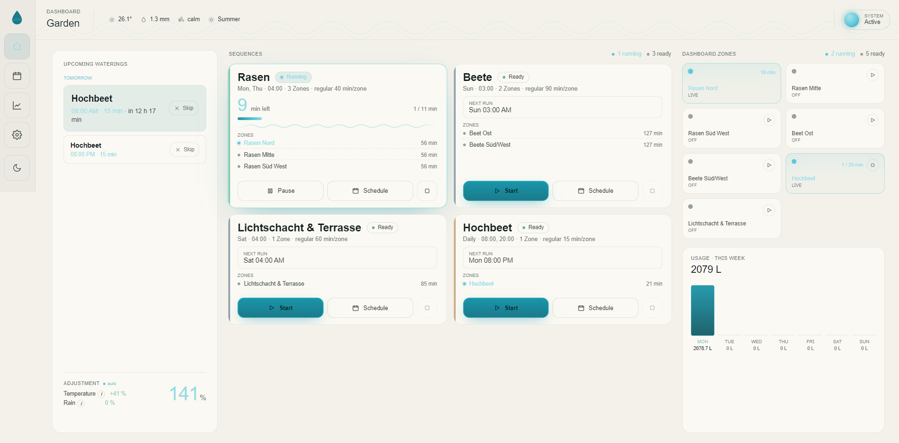</td>
    <td width="50%">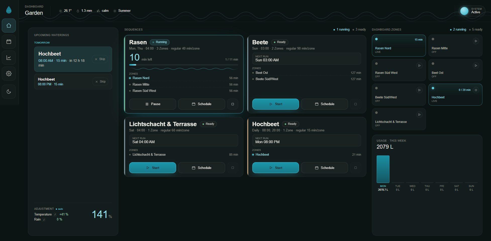</td>
  </tr>
  <tr>
    <td align="center"><sub><b>Dashboard</b> — light</sub></td>
    <td align="center"><sub><b>Dashboard</b> — dark</sub></td>
  </tr>
  <tr>
    <td width="50%">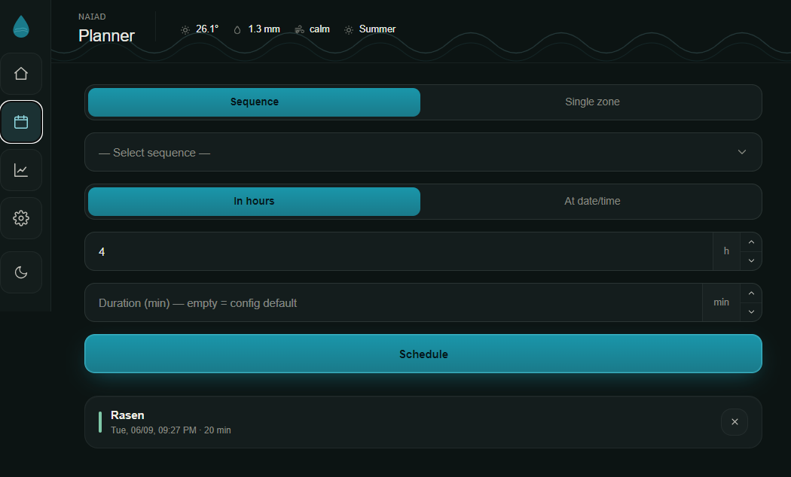</td>
    <td width="50%">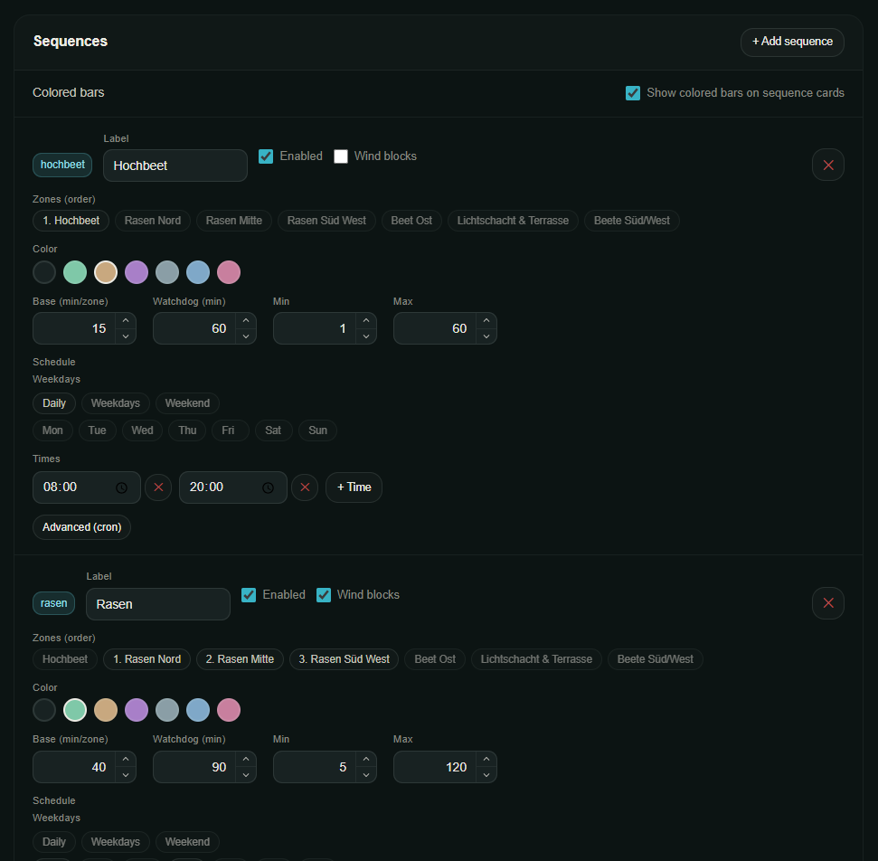</td>
  </tr>
  <tr>
    <td align="center"><sub><b>Planner</b> — manual one-off plans</sub></td>
    <td align="center"><sub><b>Sequences</b> — ordered zones &amp; schedules</sub></td>
  </tr>
  <tr>
    <td width="50%">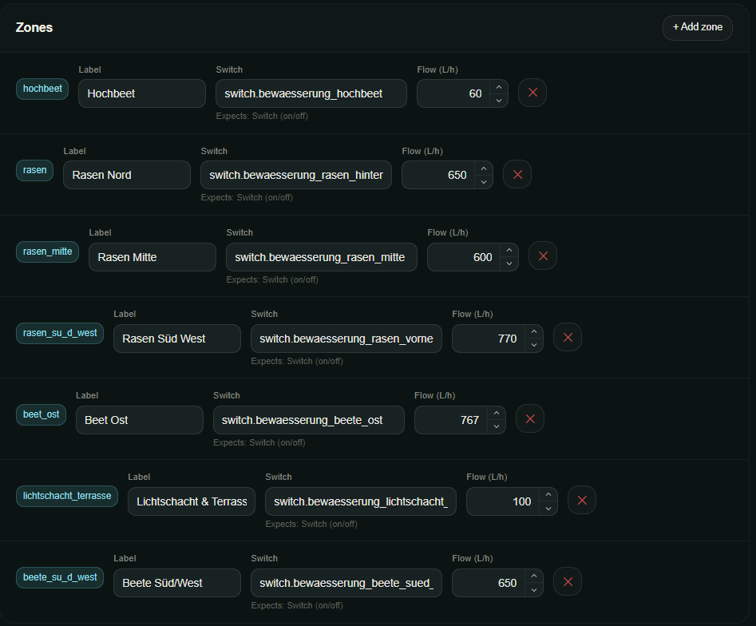</td>
    <td width="50%">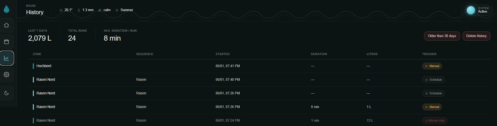</td>
  </tr>
  <tr>
    <td align="center"><sub><b>Zones</b> — valve &amp; flow configuration</sub></td>
    <td align="center"><sub><b>History</b> — per-run liters &amp; durations</sub></td>
  </tr>
  <tr>
    <td width="50%">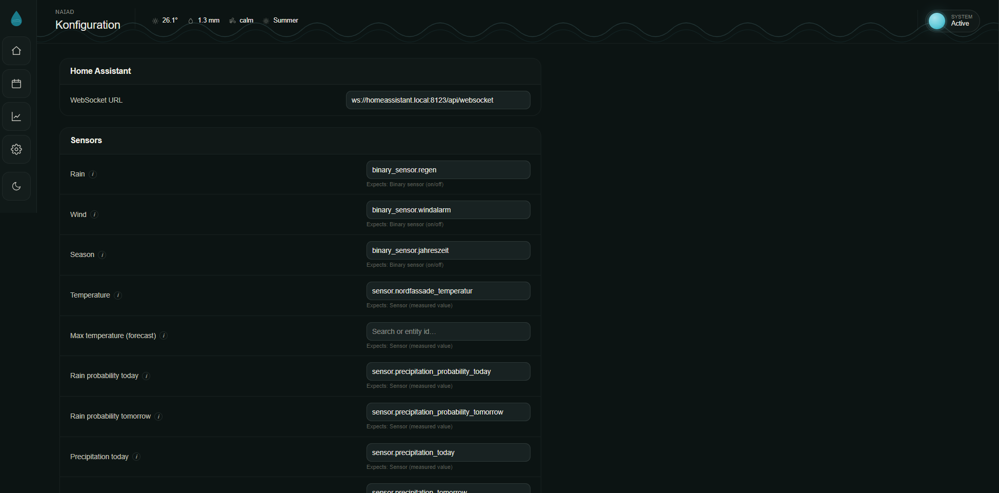</td>
    <td width="50%">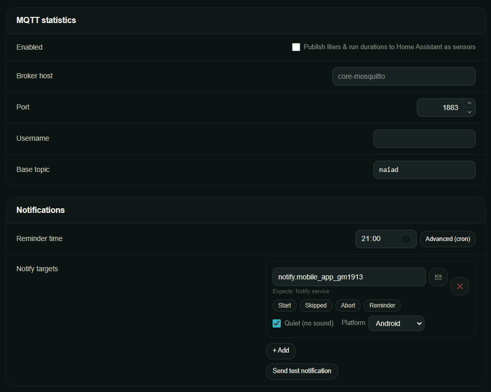</td>
  </tr>
  <tr>
    <td align="center"><sub><b>System configuration</b></sub></td>
    <td align="center"><sub><b>MQTT &amp; notifications</b></sub></td>
  </tr>
  <tr>
    <td width="50%">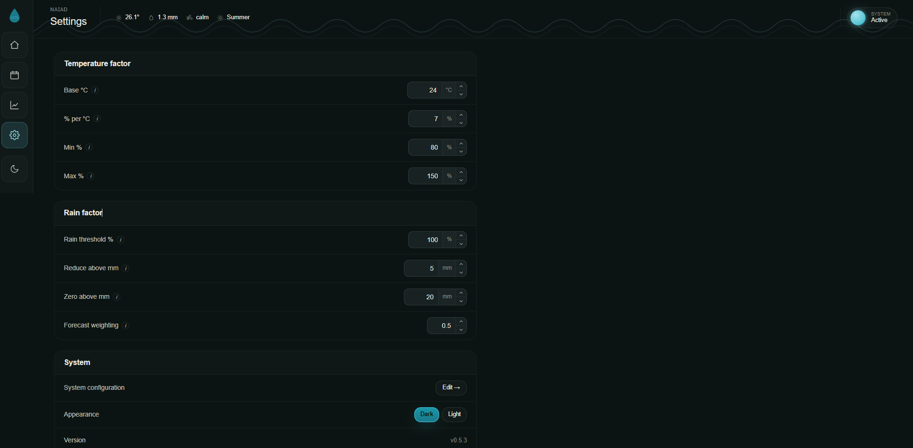</td>
    <td width="50%">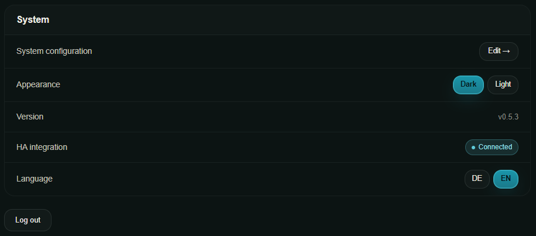</td>
  </tr>
  <tr>
    <td align="center"><sub><b>Settings</b></sub></td>
    <td align="center"><sub><b>System</b> — status &amp; diagnostics</sub></td>
  </tr>
</table>

### Mobile

<table>
  <tr>
    <td width="50%" align="center">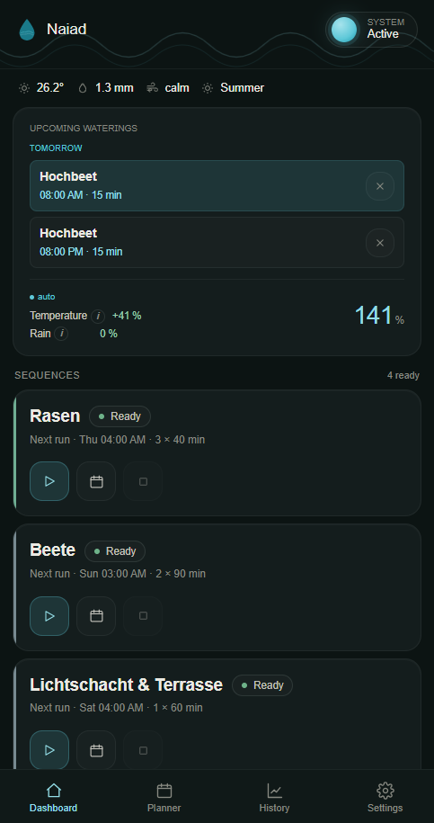</td>
    <td width="50%" align="center">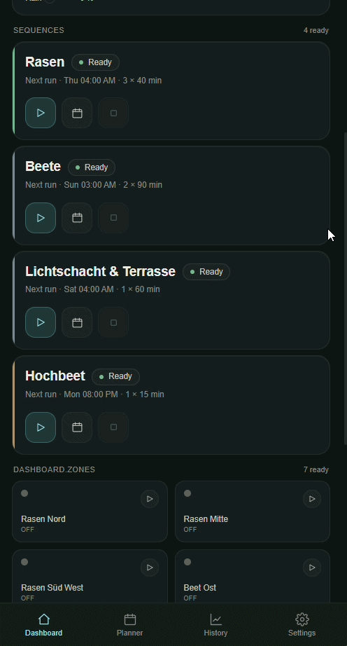</td>
  </tr>
  <tr>
    <td align="center"><sub><b>Dashboard</b> — mobile</sub></td>
    <td align="center"><sub><b>Naiad</b> — mobile walkthrough</sub></td>
  </tr>
</table>

## Disclaimer

Large parts of this project were developed with the assistance of AI tools, which significantly accelerated implementation.
While I am a professional software engineer, not all AI-generated code has been manually reviewed. This project is maintained as a hobby project and has not undergone the same level of review, testing, or quality assurance that I would typically apply in a professional environment.
This software is provided "as is", without any warranties or guarantees of any kind. Use it at your own risk.

## License

[MIT](LICENSE) — Copyright (c) 2026 Neffez.

---

<sub>Naiads are the freshwater nymphs of Greek mythology — spirits of springs, brooks and fountains. A fitting patron for a tool that decides when and how much water to send into a garden.</sub>
